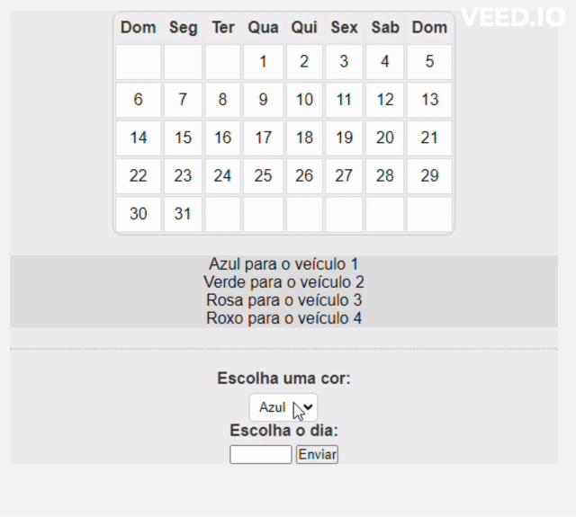

## Calendário de Veículos - Agendamento e Codificação por Cores

Este projeto cria um aplicativo de calendário simples onde você pode escolher uma cor e atribuí-la a um dia específico para seus veículos.

**índice**
* [Recursos](#recursos)
* [Tecnologias_usadas](#tecnologias-usadas)
* [Instruções](#instruções)
* [Autores](#autores)
## Recursos:

* Exibe um calendário com dias da semana e datas.
* Permite a seleção de uma cor e um dia.
* Altera a cor de fundo do dia escolhido no calendário com base na cor selecionada.

## Tecnologias Usadas:

* [<code></code>](https://developer.mozilla.org/pt-BR/docs/Web/HTML)
* [<code></code>](https://developer.mozilla.org/pt-BR/docs/Web/CSS)
* [<code></code>](https://github.com/)
* [<code></code>](https://git-scm.com/)
* [<code></code>](https://code.visualstudio.com/)
* [<code></code>](https://github.com/)

**HTML (index.html):**

Este arquivo estrutura o layout da página web, incluindo a tabela do calendário, a legenda de cores, controles de seleção (menu suspenso de cores e entrada de dia) e um botão de envio.

**CSS (style.css):**

Este arquivo define estilos para vários elementos, como a borda do calendário, cabeçalhos e células da tabela, fundo da legenda de cores, formatação de texto e espaçamento.

**JavaScript (calendario.js):**

Este arquivo contém a função `colorirDia()`. Quando o botão de envio é clicado:

1. Ele recupera o valor do dia selecionado no campo de entrada "dia".
2. Ele recupera o valor da cor selecionada no menu suspenso "cor".
3. Ele acessa o elemento da tabela do calendário usando seu ID ("calendário").
4. Ele usa `getElementsByTagName('td')` para obter todos os elementos de dados da tabela (td).
5. Ele calcula o índice da célula do dia alvo adicionando 2 ao valor do dia selecionado (considerando o deslocamento dos cabeçalhos dos dias da semana).
6. Ele acessa o elemento `td` específico usando o índice calculado e define sua propriedade de estilo `backgroundColor` para a cor escolhida.

## Instruções:

4. Abra `index.html` em um navegador web para visualizar o aplicativo de calendário.
5. Selecione uma cor e insira um número de dia (entre 1 e 31).
6. Clique no botão de envio para ver a cor do dia escolhido no calendário mudar.

**Linkedin**

[publicação do projeto no linkedin](https://www.linkedin.com/posts/fellipe-zanin-1b1a7728b_fell1pe-overview-activity-7181962291691536384-NRZG?utm_source=share&utm_medium=member_desktop)

## Autores
| [ Fellipe Gabriel Zanin](https://github.com/Fell1pe) |